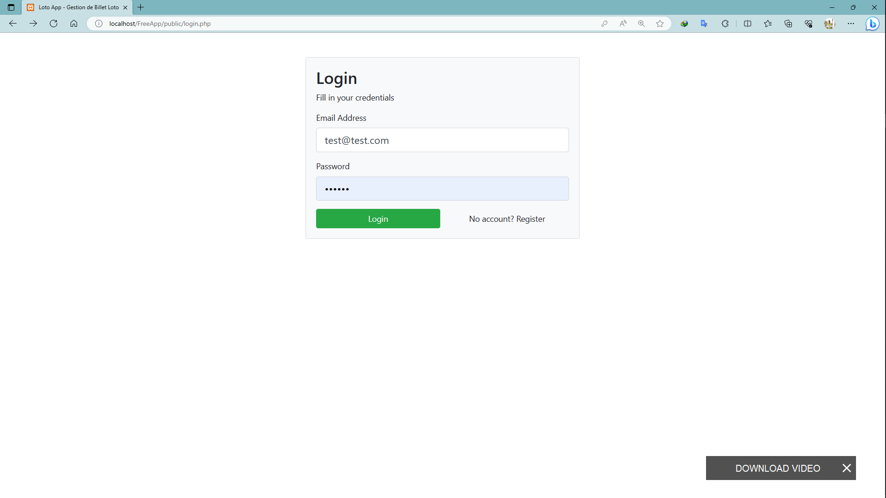
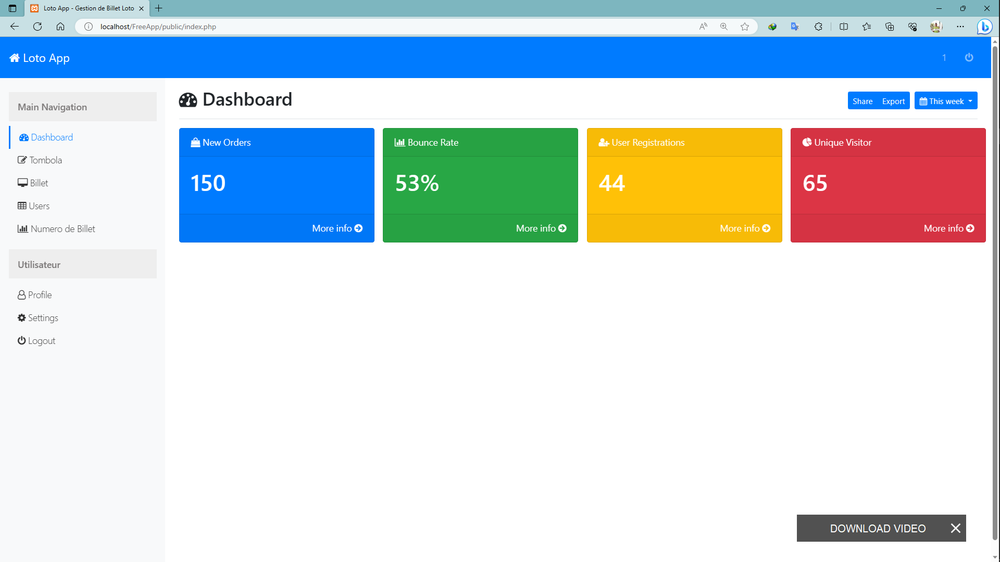
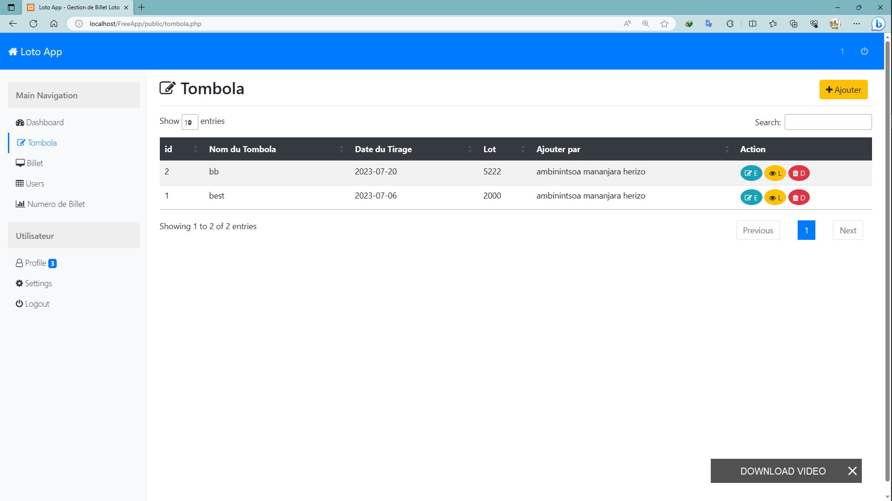
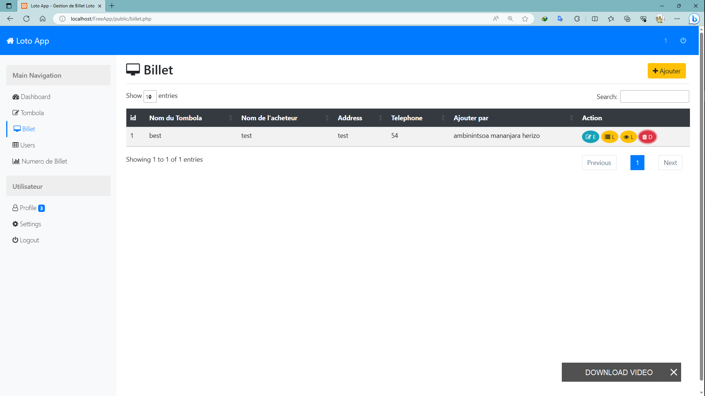
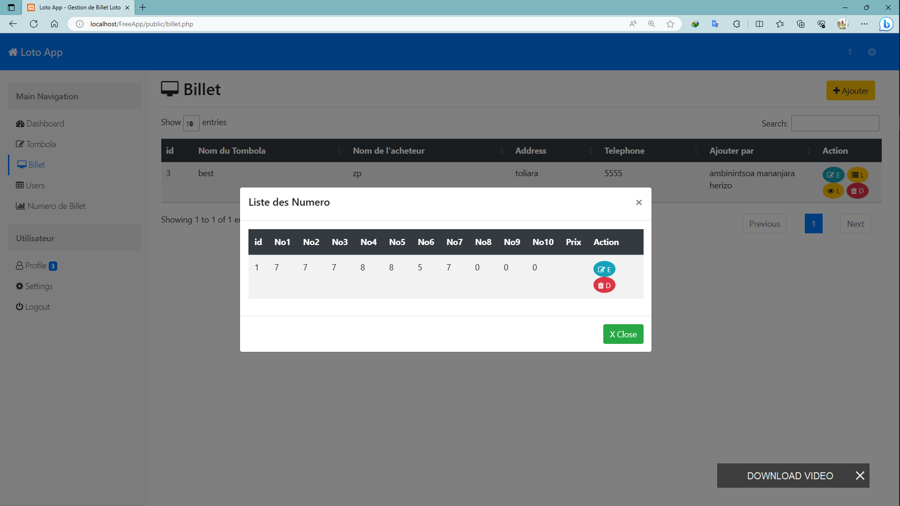
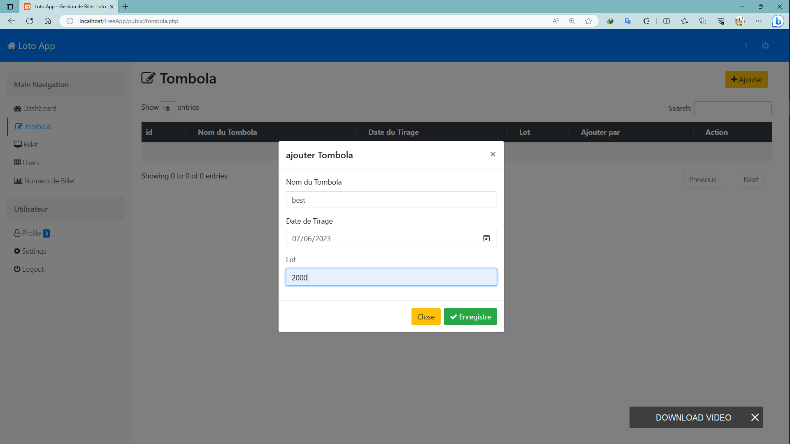
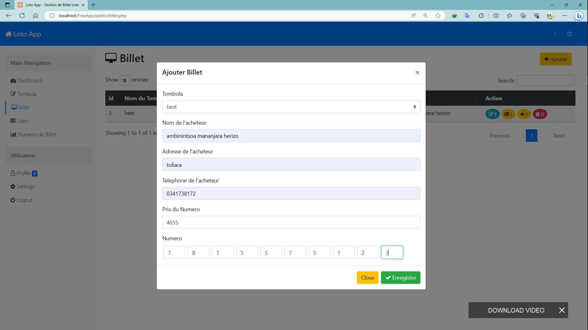
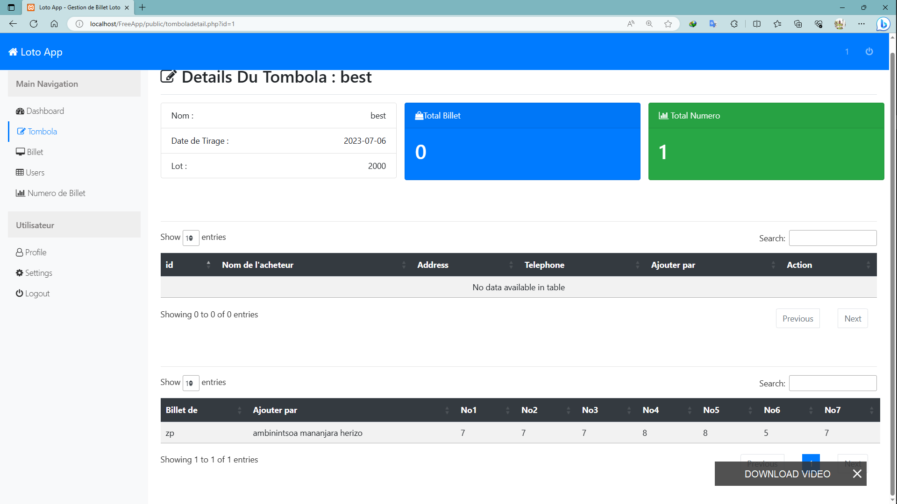
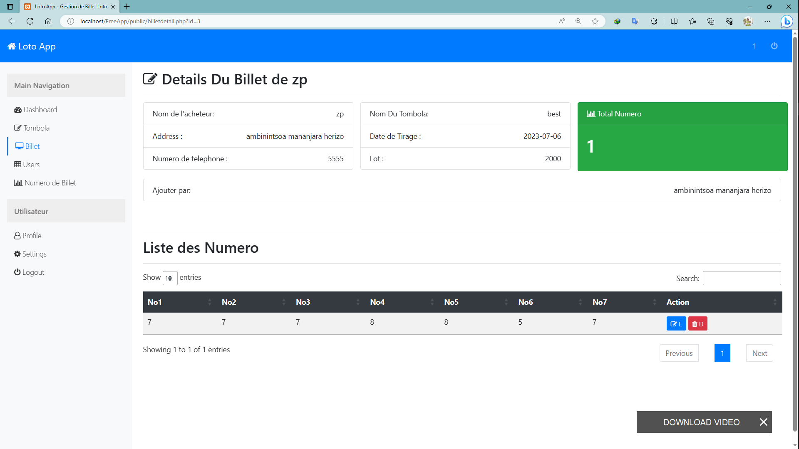

    
    

# PHP TOMBOLA Application

This PHP application demonstrates my OOP (Object-Oriented Programming) skills by implementing a CRUD (Create, Read, Update, Delete) functionality using a custom CRUD class. The application uses a database to store and retrieve data, and it includes features such as DataTable integration for listing data, AJAX requests for seamless data retrieval, and various functionalities for managing users, raffles, and raffle tickets.

## screenShoot

- `Authentification`

- `Home`

- `Listing`

- `Form`

- `Details`

## Features

- **CRUD Class**: The application includes a custom CRUD class that provides a convenient interface for interacting with the database. It encapsulates the common database operations such as creating, reading, updating, and deleting records.
- **User Management**: The application allows listing users and retrieving their details. It provides functionality for creating new users, updating existing user information, and deleting users from the system.
- **Raffle Management**: Users can view a list of raffles and access detailed information about each raffle. The application allows creating new raffles, updating raffle details, and deleting raffles as needed.
- **Raffle Ticket Management**: Users can view a list of raffle tickets and access detailed information about each ticket. The application provides functionality for creating new raffle tickets, updating ticket information, and deleting tickets when necessary.
- **DataTable Integration**: The application integrates the DataTables library to enhance the user experience when listing records. DataTables provide features like sorting, searching, and pagination for efficient data browsing.
- **AJAX Requests**: AJAX (Asynchronous JavaScript and XML) is used to make seamless and asynchronous requests to the server, enhancing the responsiveness and performance of the application.

## Requirements

- PHP (version 7.4.x)
- MySQL (or compatible database system)
- Web server (e.g., Apache)

## Installation

1. Clone the repository or download the source code.
2. Set up a web server (e.g., Apache) and ensure it can execute PHP scripts.
3. Create a new database on your MySQL server.
4. Import the provided SQL file (`lotoapp.sql`) into the newly created database.
5. Configure the database connection settings in the `config.php` file.
6. Deploy the application to your web server.
7. Open the application in your web browser and start exploring the features!

## Usage

- Navigate to the application's homepage to get started.
- Use the provided navigation menu to access different sections of the application.
- Explore the user management section to create, update, and delete user records.
- Visit the raffle management section to manage raffles and their details.
- Access the raffle ticket section to create, update, and delete raffle tickets.
- Take advantage of the DataTable integration to efficiently browse and search through the listed records.
- Enjoy the seamless user experience provided by AJAX requests for real-time data retrieval.

## Contribution

Contributions to this project are welcome. If you have any suggestions, bug fixes, or new features to propose, please open an issue or submit a pull request.

## License

This PHP CRUD Application is released under the [MIT License](https://opensource.org/licenses/MIT).

## Acknowledgments

This application was developed to showcase my OOP skills and to provide a practical example of a PHP CRUD application. Special thanks to the DataTables library for enhancing the data listing capabilities and to the AJAX technology for improving the user experience.

## Contact

For any inquiries or feedback, please contact me at [ambinintsoa.business@gmail.com](mailto:ambinintsoa.business@gmail.com).

    
    

